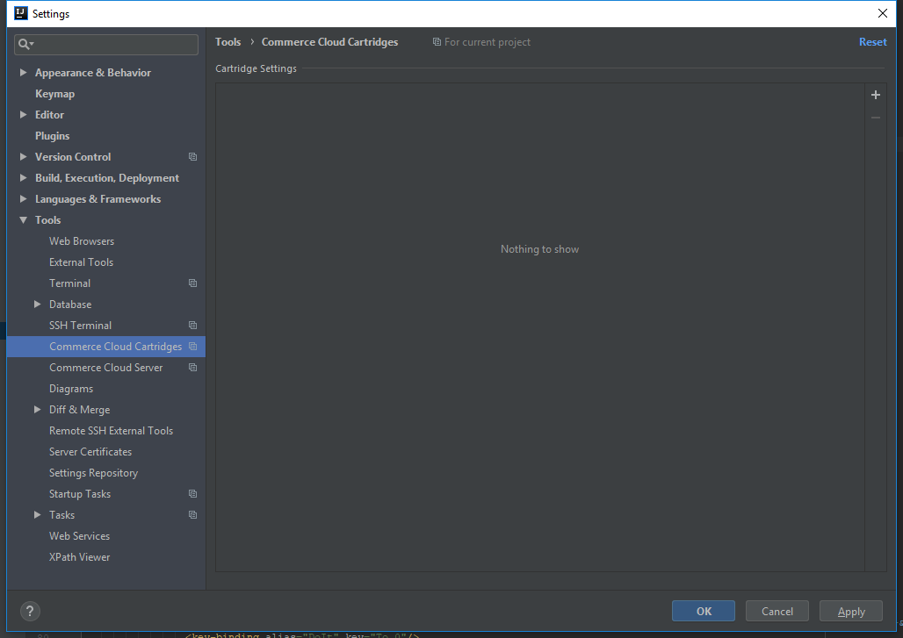

# Salesforce Commerce Cloud (SFCC) Studio

<!-- Plugin description -->
## The original plugin for developing Salesforce B2C Commerce (SFCC) sites</h2>

SFCC Studio has features such as script debugging, code synchronization, syntax highlighting, auto complete and more...

### Features
 * Script Debugger
 * Project wizard to set up a project with ease.
 * Cartridge root configuration settings.
 * Sandbox filesystem sync
 * Sandbox filesystem clean
 * Remote sync console log with links to synced files
 * Script injection into isscript elements and ${} braces
 * Basic auto completion for ISML tags, attributes, and known valid attribute values.
 * Live template shortcuts for ISML tags.
 * New DS and ISML file actions
 * And more...

<!-- Plugin description end -->

## Installation

- Using IDE built-in plugin system:

  <kbd>Preferences</kbd> > <kbd>Plugins</kbd> > <kbd>Marketplace</kbd> > <kbd>Search for "sfcc-studio-template"</kbd> >
  <kbd>Install Plugin</kbd>

- Manually:

  Download the [latest release](https://github.com/nek4life/sfcc-studio/releases/latest) and install it manually using
  <kbd>Preferences</kbd> > <kbd>Plugins</kbd> > <kbd>⚙️</kbd> > <kbd>Install plugin from disk...</kbd>
 
## Plugin configurations

<kbd>File</kbd> > <kbd>Settings</kbd> > <kbd>Tools</kbd> > <kbd>Commerce Cloud Cartridges</kbd>

 

<kbd>File</kbd> > <kbd>Settings</kbd> > <kbd>Tools</kbd> > <kbd>Commerce Cloud Server</kbd>

 

## Plugin Development

This project is now Gradle based and is much easier to get the development
environment setup to work on the plugin. You should only need to import the
project in either Intellij Community or Intellij Ultimate and execute the runIde
Gradle task. For more information please see the official Jetbrains plugin
development documentation.

http://www.jetbrains.org/intellij/sdk/docs/tutorials/build_system.html

## Plugin on the JetBrains site
https://plugins.jetbrains.com/plugin/11590-salesforce-commerce-cloud-studio
